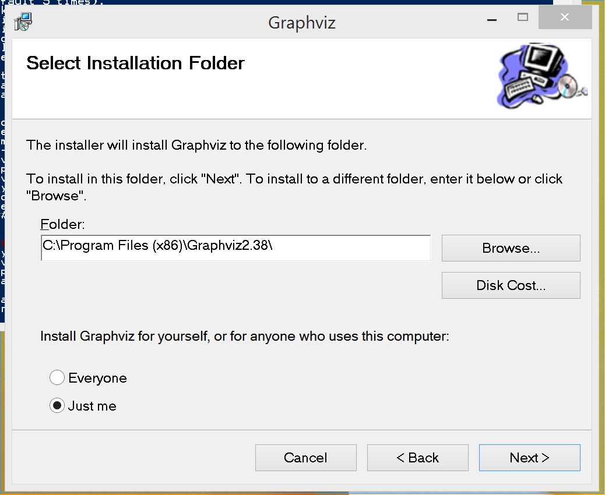

# Installation

01. [Overview](#overview)
02. [Quick start (for power users)](#quick-start-(for-power-users))
03. [CollateX installation](#collatex-installation)

___

## 1. Overview

This tutorial explains how to install Python 3 and CollateX. 

## 2. Quick start (for power users)

If you have already installed CollateX, make sure that you have the most recent version by running:

    pip install --upgrade collatex

If not, here are the installation instructions in a nutshell. **If you are unsure on how to proceed, follow the instructions at point 3 and 4!**

1. Ensure Python 3, preferably the Anaconda distribution
1. `pip install collatex`
1. `pip install python-levenshtein` (but see the note below for Windows)
1. Install Graphviz, either through a package manager such as apt-get or MacPorts, or go to http://www.graphviz.org/Download.php and accept the license
1. `pip install graphviz`

## 3. CollateX installation

To run CollateX, you need first to install Python 3 and then the CollateX module, along with some other programs, packages, and modules upon which CollateX depends. Here’s how to do that in Mac OS X, Ubuntu Linux, and Windows. The process described below will probably take between thirty minutes and an hour, depending on how familiar you are with installing programs on your system. The good news is that you only have to do the installation once, and launching CollateX after that will take almost no time. This tutorial assumes that you are running Mac OS X 10.11 or later, Windows 7, 8, or 10, or Ubuntu Linux 14.04 LTS or later. In all of the steps below, if you are prompted to enter your password, you should do so.

### 3.1. Installing Python

Your system may already have some version of Python installed, but we recommend that you install and use the Anaconda Python distribution. CollateX will work with other distributions of Python 3 (not all functionality is available with Python 2), but the installation and configuration is more complicated, so for the workshop we are using Anaconda. The following instructions suppose your are using Anaconda.

Installing Anaconda according to the instructions on their site should not interfere with other existing Python versions on your system.

For Mac OS, Linux, and Windows, the Python installation instructions are the same: download and install Anaconda Python from https://www.anaconda.com/products/individual. 

#### Extra instructions for Linux users

The Anaconda package installer on Linux is not a clickable installation program as on Mac OS and Windows. You will need to choose to save the file, and then make a note of where the installer was saved (most likely your Downloads folder). You will then open a command line window (Ctrl-Alt-T on Ubuntu) to type the command

    bash Downloads/Anaconda3-2020.07-Linux-x86_64.sh

where Downloads is replaced with the name of the folder in which you saved Anaconda, if it is different one.

Some users have reported errors when trying to install from the Download directory. Should that happen to you, try moving the file to your home directory and installing from there.

When asked, say yes to everything. When the installation is finished, type `exit` to close the command line window. (You need to do this, even though you will open a new one shortly!)

### 3. 2. Installing CollateX

#### 3. 2. 1. Using the command line

Once you have installed Python, as described above, you need to install CollateX, along with a few supporting files (libraries). To do this, you will need to work with a command line window. Each operating system makes a terminal available by default, without requiring special installation:

* For Mac OSX: the Terminal.app that you will find in the Applications → Utilities folder.
* For Windows: Windows Powershell, which you can find from the search box. Windows 10 users who have installed the new Windows bash shell may use that instead.
* For Ubuntu Desktop (Unity): you can type Ctrl-Alt-T or you can type “Terminal” (without the quotation marks) into the Search box in the Dash.

A window will open that displays a command line, a place where you can type instructions to be executed on the computer, with a prompt that might look something like this on a Mac OS Terminal:

    Taras-Mac:~ tara$

or this in the Windows Powershell:

    PS C:\Users\Tara L Andrews>

or this in a Linux terminal:

    tla@ubuntu:~$

Now you are ready to type the commands that come next.

Windows users: Some of you may have used **cmd.exe** in the past to work at the command line. We recommend Powershell (or, for Windows 10 users, bash) because it uses many of the same commands that have always been in use on Unix-like systems, and so makes it easier for you to follow generic command-line instructions such as those we will be giving in the workshop. If you stick to **cmd.exe** you do so at your own risk, and the commands described below may not all be available.

#### 3.2.2. The CollateX installation

The easiest way to install CollateX from the command line is with **pip**, a Python package manager. **pip** comes bundled with Anaconda, so you don’t have to install it separately, and you can install CollateX and the most of the libraries on which it depends by typing:

    pip install collatex

### 3.3. Installing the Python Levenshtein library

CollateX relies on this library to do near (inexact) matching of words.

#### 3.3.1. For Mac OS X and Linux

Type the following at the command line:

    pip install python-levenshtein

Mac OS users: You may get a popup window telling you that you require the command-line developer tools. If you get this window, choose Install. When the installation is finished, run the command again.

Once this is done, you can check that everything worked by opening a terminal, typing the following command, and hitting the Enter key:

    python -c "import Levenshtein; print('This works.')"

#### 3.3.2. For Windows 

The easiest way to get the python-levenshtein library on your computer is to install it from the Anaconda Navigator:

1. open the Anaconda Navigator and select environments
2. in the dropdown menu of the right-hand panel, select 'Not installed'
3. in the search box, search for 'levenshtein'
4. the package appears in the list! Select it by clicking the checkbox
5. click 'Apply' at the bottom of the screen

Once installed the package you can check that everything worked with the following command:

    python -c "import Levenshtein; print('This works.')"

### 3.4. Installing Graphviz (recommended but not mandatory)

Graphviz is a program for creating graphic representations, including the variant graphs sometimes used in CollateX (see the examples at http://stemmaweb.net/stemmaweb/relation/help/Latin). Graphviz is required by CollateX only for viewing variant graphs. We recommend instaglling it for the workshop, but you can perform collations without it. Note that in addition to installing Graphviz, all users need to install Python bindings for Graphviz, which is a separate step, described in Section 3.5, below.

#### 3.4.1. Installing Graphviz on Mac OS X

The easiest way to install Graphviz is to use Homebrew. 

1. If you don't have it, install Homebrew, following the instructions here: <https://brew.sh> (just paste the line in the terminal, as indicated)
2. Install Graphviz: paste into terminal
    
    `brew install graphviz`

#### 3.4.2. Installing Graphviz on Ubuntu Linux

Graphviz can be installed from the Terminal on Ubuntu with the command:

    sudo apt-get install graphviz

#### 3.4.3. Installing Graphviz on Windows

The easiest way to install Graphviz is to download the appropriate installer from the [Graphviz download page](https://graphviz.org/download/) (you will need to accept the license.) When possible, choose the Stable Release (not Developer). On Windows, use the **.msi** file if you can.

When the installer shows the screen in the image on the right, copy the *full and exact folder name* down somewhere. When the installer is done, you will need to add this information to your execution path.

1. From the Control Panel, choose System and Security → System → Advanced settings, and then click the Environment variables button near the bottom of the window.
1. Select the entry in the list that says PATH and choose Edit.
1. Scroll all the way to the end of whatever is already there, and add a “;” character (without the quotes), then the exact folder name you copied, and then “\bin” (also without the quotes). In the example above, you would append “;C:\Program Files (x86)\Graphviz2.38\bin” (without the quotes, but with the leading semicolon) to the end of your original path, as in the image below.

1. To confirm that the path has been set correctly, close any open Powershell or bash window you have, open a new one, and run the command `where.exe dot`. Do not leave off the “.exe”! The output should look something like:

        PS C:\Users\Tara L Andrews> where.exe dot
        C:\Program Files (x86)\Graphviz2.38\bin\dot.exe

### 3.5. Installing the Python Graphviz bindings

In addition to Graphviz itself, all users on all operating systems also need to install Python bindings (support) for Graphviz, which you can do at the command line by typing:

    pip install graphviz

Note that the preceding line does not install Graphviz; what it installs is just the Python bindings for Graphviz. You also need to install Graphviz itself, as described in Section 3.4 and its subsections, above.
